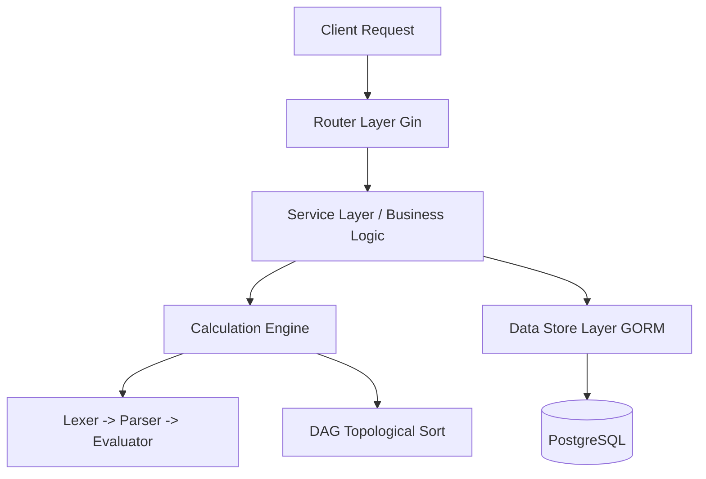

# Architecture Guide: Calculation Engine (PIM System)

## 1. Overview
This repository contains a lightweight Product Information Management (PIM) system built in Go. It supports the management of Categories, Attributes, and Products. 

The standout feature of this system is an **embedded calculation engine**, consisting of a handwritten Lexer, Parser, and Evaluator. This engine interprets an Excel-like formula language to evaluate expressions defined on PIM Attributes dynamically. A Directed Acyclic Graph (DAG) is leveraged to determine the correct evaluation order and prevent cyclic dependencies.

## 2. High-Level Architecture
The system adopts a layered architecture approach using the **Gin** HTTP web framework and **GORM** for persistence.

## 3. Directory Structure and Layers

### `router/` (API Layer)
Defines all HTTP endpoints and routes. Uses the `gin-gonic/gin` framework to bind JSON payloads, validate requests using `go-playground/validator`, and route calls to the appropriate service functions.

### `service/` (Core Logic Layer)
Contains the core business and domain logic. It acts as the bridge between HTTP handlers and the data access layer.
- **Entity Services:** `attribute`, `category`, `product`, `formulas` modules handle lifecycle and assignments.
- **`parser/` & `evaluator/`:** The core calculation engine. Implements Vaughan Pratt's top-down operator precedence parsing (Pratt Parser).
  - **Lexer**: Tokenizes formulas into identifiable string sequences.
  - **Parser**: Parses tokens into an Abstract Syntax Tree (AST).
  - **Evaluator**: Evaluates the AST using standard operations natively transformed into Go types.
- **`dag/`:** Directed Acyclic Graph component. Used to identify the evaluation sequence of dependent formulas (Topological Sort) and catch cyclic dependency errors during formula creation.

### `store/` (Data Access Layer)
Interfaces with PostgreSQL. 
- **`models.go`**: Defines the GORM entities representing the database schema (`Attribute`, `Formulas`, `Category`, `Product`, `FormulaDependencies`, etc.).
- **`store.go` & `postgres.go`**: Database connection pool and automigration logic setup.

### `models/` (API Payload Models)
Defines the Request and Response DTOs (Data Transfer Objects) for different endpoint interactions independent of the pure database GORM models.

## 4. Key Workflows

### Defining a Formula
1. **User Request**: Provides Target Attribute, Source Attributes (Dependencies), and an Expression String.
2. **Lexing & Parsing**: The expression is validated. Syntax is checked using `parser.NewParser`.
3. **Dependency resolution**: Dependencies are checked against a DAG graph. If a topological sort evaluates a cycle, creation is rejected.
4. **Persistence**: Dependencies and formula meta-info stored in DB (`FormulaDependencies`, `Formulas`).

### Evaluating Products
1. **Fetch Dependencies**: Data arrays are fetched from `Product` tables along with variables.
2. **Sort**: Execution order is inferred from DAG Topological sort.
3. **Environment Map**: Map of identifiers created in memory.
4. **Evaluate**: Ast evaluated against Environment map using `evaluator.Eval()`. Values updated cumulatively.
